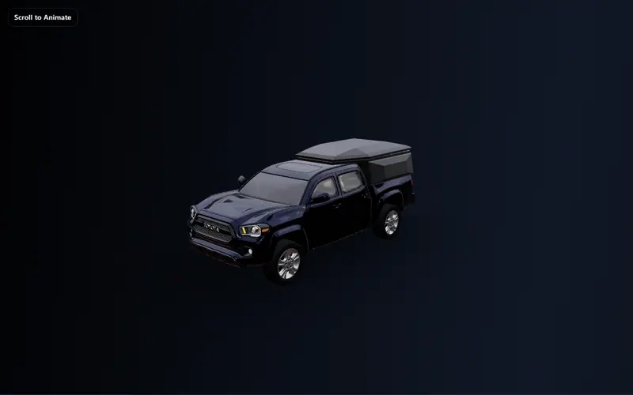
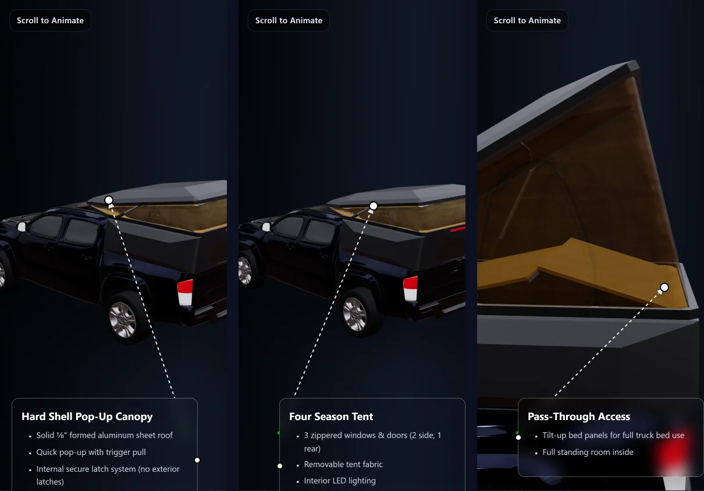

# Madix Outdoors 3D Website

A scroll-driven 3D product page for the Madix Outdoors truck-bed camper. Scrolling plays the camper's animations (canopy, tent, doors, hatches) on a live Three.js model, with camera moves and feature callouts pinned to parts of the model.

**Live site:** https://madixoutdoors.harrison-martin.com



## Features

- Config-driven scroll sections: each section declares which animation clips it scrubs or snaps and where the camera goes
- Fixed camera poses with eased transitions, and timed flythroughs
- Callouts anchored to named objects in the model, drawn as HTML overlays with leader lines, with separate top and bottom placement on phones
- Draco-compressed, gzipped GLB, decompressed in the browser
- Docker multi-stage build served by nginx



## Quick start

Requires Node.js 18+.

```bash
npm install
npm start          # http://localhost:3000
npm run build      # production build in build/
```

### Docker

```bash
docker compose up --build      # http://localhost:9042
```

## Editing the page

**Sections** are defined in `buildSectionDefs()` in `src/components/ScrollSections.js`:

```js
{
  id: 4,
  label: "Door Open",
  actions: [
    { mode: "scrub", clip: door, map: (s) => s },          // clip time follows scroll progress
  ],
  camera: {
    mode: "fixed",                                          // or "timeline" with a list of poses
    getPose: () => ({ position: new THREE.Vector3(1.7, 1.15, -0.8), target: new THREE.Vector3(-0.7, 0.9, -0.8) }),
    baseDuration: (_, fast) => (fast ? 1.0 : 3.0),
  },
}
```

- `scrub` maps the section's scroll progress (0–1) through `map` to the clip's time.
- `snap` sets a clip to a fixed time `t`, optionally only `when` a condition holds.
- Each section needs a matching tall element in the `ScrollSections` layout.

**Callouts** live in `annotationTargets` in `src/components/AnnotationSystem.js`, keyed by section. `objectName` must match a node name in the GLB; `description` supports `*` bullet lines; `position` (`"top"` or `"bottom"`) applies only below 768 px.

**The model** is `public/Tent3.glb`. After replacing it, regenerate the compressed copy the site actually loads:

```bash
npm run compress-glb      # writes public/Tent3.glb.gz (PowerShell)
```

Animation clip names used by the sections: `TentOPENCLOSE`, `Door`, `Side`, `BackWindow`, `matress`, `animation0`.

## Project structure

```
src/App.js                          layout, canvas, loading overlay
src/components/SceneContent.js      loads the GLB, applies scrubbed clip times
src/components/ScrollSections.js    section config, scroll progress, camera driver
src/components/CameraRig.js         eased camera transitions
src/components/AnnotationSystem.js  callout targets, 3D → screen projection
src/components/AnnotationOverlays.js  callout cards and leader lines
src/hooks/useGzipGLTF.js            gzip + Draco GLB loading
nginx.conf, Dockerfile, docker-compose.yml   production container
```

## Performance note

About 10.5 MB of the 12.3 MB model is one mesh's 31 morph targets, which Draco doesn't compress. Re-encoding with meshopt (`npx @gltf-transform/cli meshopt Tent3.glb out.glb`) brings the file to about 4.8 MB (3.5 MB gzipped). This hasn't been visually verified yet, and the loader would need `MeshoptDecoder` instead of the gzip step.

## Contributing

Issues and pull requests are welcome. The meshopt switch above is the highest-value change.
